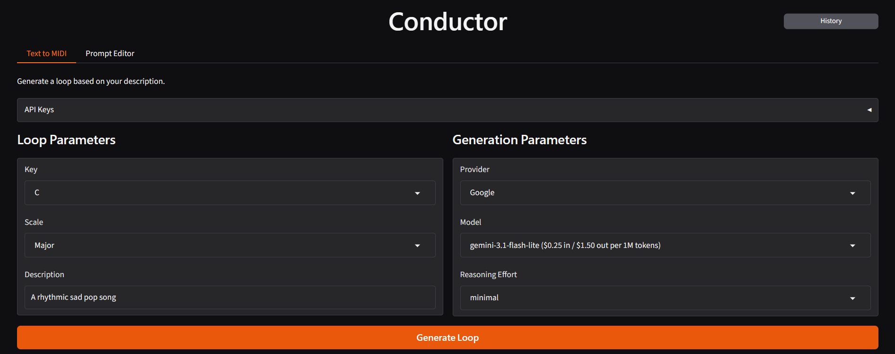

# Conductor Main

`conductor-main` is the interactive Gradio client for `conductor-core`. It turns
the reusable engine into a browser-based workflow for generating, auditioning,
visualizing, editing, and revisiting four-bar MIDI loops.



The app owns UI layout, callback adaptation, UI state, prompt editing, and its
Plotly piano roll. Core owns provider routing, generation, MIDI conversion,
audio helpers, and persisted artifacts. This separation allows another UI or
service to replace Conductor Main without rewriting the engine.

## Quick Start

Install [uv](https://docs.astral.sh/uv/getting-started/installation/), then run:

```powershell
uv sync --locked
uv run --locked conductor-main
```

The app opens at `http://127.0.0.1:7860/`.

## Key Features

- Natural-language four-bar MIDI loop generation across multiple LLM providers (OpenAI, Anthropic, Google, Ollama).
- Interactive Plotly piano roll visualization and MIDI download for DAW import.
- Built-in audio rendering and playback via FluidSynth and SoundFonts.
- Model-adaptive controls (temperature, reasoning toggles, reasoning effort).
- Session history with generation reload and audio re-rendering.
- Customizable prompt overrides.

## Documentation

Full documentation formatted for MkDocs is available in the [`docs/`](docs/) directory:

- [Getting Started & Provider Setup](docs/getting-started.md)
- [Usage Guide & Controls](docs/usage.md)
- [Audio, SoundFonts & Data Management](docs/audio-and-data.md)
- [Development, Validation & Troubleshooting](docs/development.md)

To browse the documentation locally with MkDocs:

```powershell
uv sync --locked --extra docs
uv run --locked --extra docs mkdocs serve
```

The documentation server opens at `http://127.0.0.1:8000/`.

## Development and Validation

```powershell
uv sync --locked --extra dev
uv run --locked --extra dev ruff format --check .
uv run --locked --extra dev ruff check .
uv run --locked --extra dev pytest -q
uv build
```
