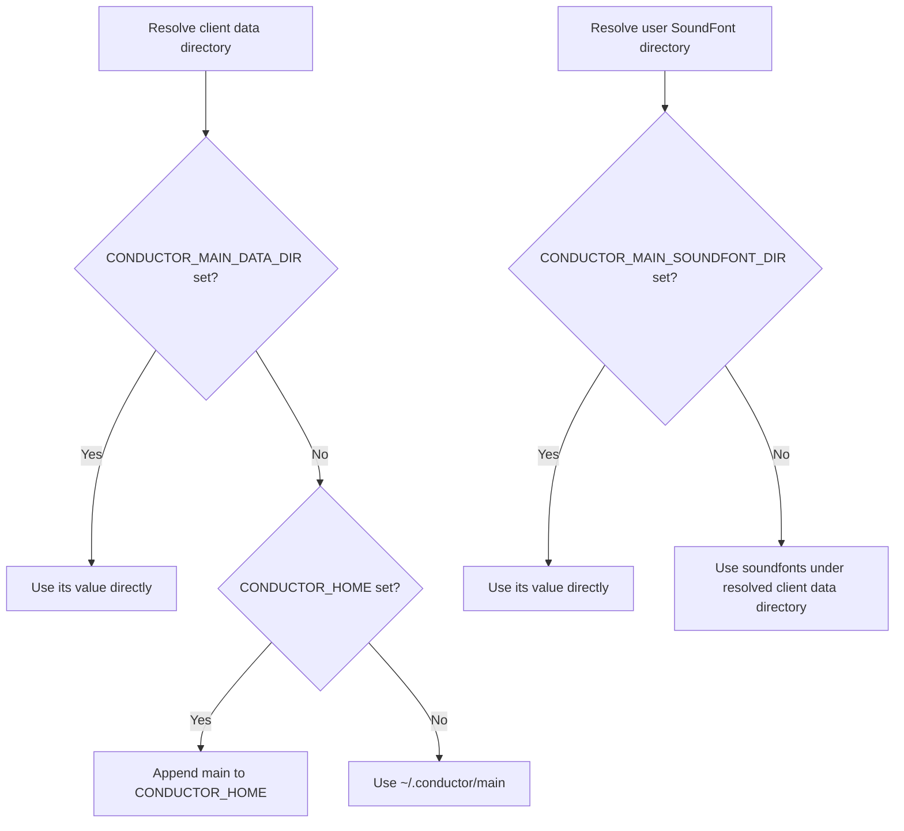

# Audio & Data Management

## Data Directory

Conductor applications share a single user-accessible data root. By default, this client owns the `main` directory below that root:

```text
~/.conductor/main/
├── generations/       # retained MIDI, audio, messages, and metadata
├── Prompts/           # durable prompt overrides
└── soundfonts/         # user-supplied SoundFonts
```

On Windows, `~` normally expands to `%USERPROFILE%`, so the same location is `%USERPROFILE%\.conductor\main`. These files survive repository, virtual environment, and package replacement. Back up `Prompts` and any user-supplied SoundFonts as durable user data. Generation history is retained to the newest 20 items and can be deleted through the History sidebar when reclaiming space.

### Location Precedence

1. `CONDUCTOR_MAIN_DATA_DIR` selects this client's complete data directory;
2. `CONDUCTOR_HOME` selects the shared suite root and this client appends `main`;
3. the default is `~/.conductor/main`.

`CONDUCTOR_MAIN_SOUNDFONT_DIR` independently overrides only the directory used for user-supplied SoundFonts. For example, PowerShell users can relocate the whole suite or just this client:

```powershell
$env:CONDUCTOR_HOME = "D:\ConductorData"
$env:CONDUCTOR_MAIN_DATA_DIR = "D:\ConductorData\custom-main"
$env:CONDUCTOR_MAIN_SOUNDFONT_DIR = "D:\Music\SoundFonts"
```

The most specific variable wins. Relative paths remain relative to the process working directory, while paths beginning with `~` expand to the user home.



## SoundFonts and Audio Playback

The app discovers packaged and user-available `.sf2` SoundFonts through Core. Core ships the default SoundFont; drop additional `.sf2` files into the `~/.conductor/main/soundfonts/` directory (or the directory set by `CONDUCTOR_MAIN_SOUNDFONT_DIR`) to make them selectable.

Audio rendering requires all of the following:

1. The `conductor-core[playback]` dependencies;
2. FluidSynth installed and available on `PATH`;
3. FFmpeg installed and available on `PATH`;
4. An available SoundFont.

Use **Refresh SoundFonts** after adding a SoundFont while the app is running. Select a different SoundFont and click **Re-render Audio** to audition the current MIDI without regenerating it or making another provider call.

If the audio toolchain is unavailable, MIDI generation still succeeds. The app shows the setup problem and leaves playback empty.

## History and Saved Generations

Click **History** to open the recent-generation sidebar. From there you can:

- Select and **Load** a previous generation;
- **Delete** a generation and its saved files;
- **Refresh** the list after external changes;
- Inspect prompt, model, reasoning settings, musical settings, time, and cost summaries.

By default, the app keeps the newest 20 generations under its data directory:

```text
~/.conductor/main/generations/
└── gen_<id>/
    ├── loop.mid
    ├── loop.mp3        # when audio rendering succeeds
    ├── messages.json
    └── metadata.json
```

Loading history restores its MIDI, saved audio, visualization, generation ID, SoundFont metadata, loop parameters, provider, model, temperature, and reasoning controls. The restored controls remain editable, so a historical setup can be adjusted before generating again.

Older history entries that did not record reasoning settings use the current model defaults and show a warning. Saved providers or models that are no longer available remain visible with an unavailable label instead of being silently replaced. Missing SoundFonts are also identified while saved audio remains available.
