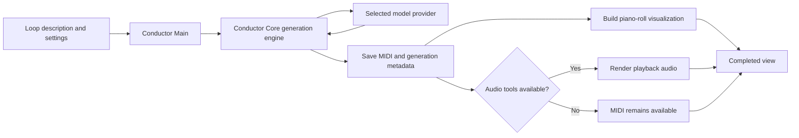
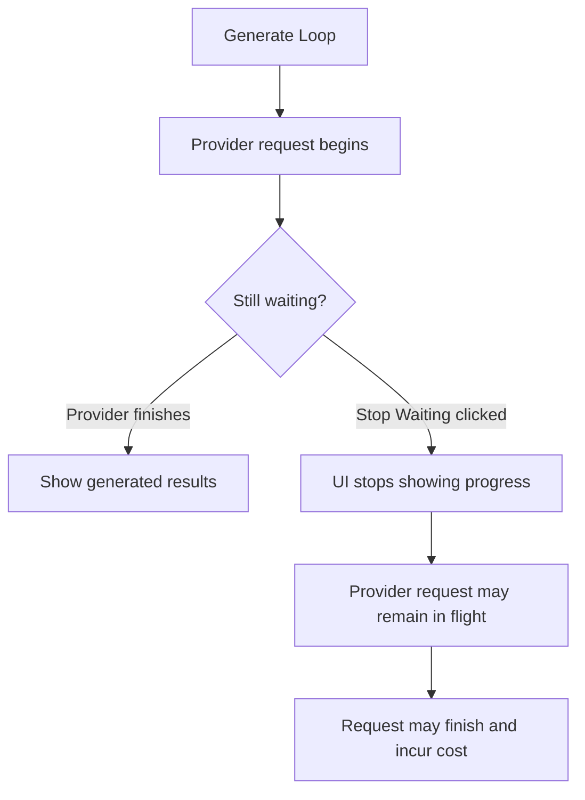

# Usage Guide

## Generate a Loop

1. Open the **Text to MIDI** tab.
2. Choose the musical **Key** and **Scale**.
3. Describe the musical idea, instrumentation, rhythm, or mood.
4. Select a **Provider** and **Model**.
5. Adjust the model controls that are visible.
6. Select a SoundFont if audio playback is configured.
7. Click **Generate Loop**.

The completed view provides:

- **Download Generated MIDI**: Import the loop into a DAW.
- **Playback**: Play rendered audio when audio synthesis succeeds.
- **MIDI Visualization**: An interactive four-bar piano roll powered by Plotly.
- **Status**: Concise feedback on provider, parsing, rendering, or configuration issues.

A useful description is specific without trying to reproduce the entire system prompt. For example:

```text
warm neo-soul electric piano chords with syncopated upper extensions and a simple bass movement
```

The selected key and scale are added to the request automatically.

### What happens during generation



Conductor Main collects the settings and presents the results, while Core owns
provider communication, structured response parsing, MIDI creation, persistence,
and optional audio rendering.

## Model-Specific Controls

Conductor Main reads packaged model metadata and adapts its controls when the provider or model changes:

| Control | Behavior |
|---|---|
| **Temperature** | Shown for models that accept sampling temperature |
| **Reasoning** | Toggle used by supported Anthropic and Google models |
| **Reasoning Effort** | Model-specific choices such as `minimal`, `low`, `high`, or `xhigh` |

Changing providers resets the model to a valid choice and refreshes dependent controls. A hidden control is intentionally unavailable for that model rather than missing from the installation.

Model labels show input and output prices per one million tokens when pricing metadata is available. The saved generation records the provider-reported cost; local Ollama generations normally have zero API cost.

## Prompt Editor

The **Prompt Editor** tab displays the current loop-generation system prompt. Saving creates or updates the app-owned override at `~/.conductor/main/Prompts/loop gen.txt`. Subsequent generations use that override instead of Core's packaged default.

The prompt defines the structured loop contract, timing conventions, and broad musical guidance. Make targeted changes and keep the required output schema intact; an invalid or ambiguous schema can cause provider parsing failures.

Deleting the override file returns the app to Core's packaged prompt.

## Stop Waiting Behavior

Generation runs in a background thread so Gradio can continue yielding status updates. **Stop Waiting** detaches the UI from the current wait, but it cannot cancel a provider request already in flight. The provider may still finish and incur cost after the UI stops displaying progress.


